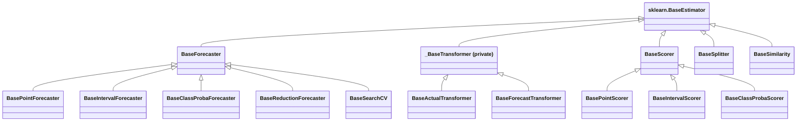

# Core Concepts

Yohou turns time series forecasting into a supervised learning problem while preserving
temporal structure. Rather than inventing a new estimator API, it extends Scikit-Learn's
familiar `fit`/`predict` interface with a small set of time-aware operations (`observe`,
`rewind`, and composite methods like `observe_predict`) so that any Scikit-Learn regressor
can power a forecaster. This page explains the concepts that make that bridge work.

## The Forecasting Workflow

The forecasting lifecycle is cyclical rather than sequential. Problem definition establishes what variable to predict, over what horizon, and which decisions the forecast will drive, shaping every subsequent choice from data granularity to evaluation criteria.

Data preparation addresses the realities of collecting and cleaning historical observations and exogenous predictors. Common scenarios such as missing values, outliers, and frequency mismatches are covered in the How-to Guides: [Handle Missing Data](../how-to/handle-missing-data.md), [Handle Outliers](../how-to/handle-outliers.md), and [Handle Long Series](../how-to/handle-long-series.md). Exploration of the cleaned series reveals [temporal patterns](time-series-patterns.md) such as trend, seasonality, cycles, and structural breaks, which guide the choice of transformers and model configurations.

Method selection and evaluation form the core iterative loop. A candidate configuration is fitted and its accuracy measured using temporal cross-validation and appropriate [accuracy metrics](forecast-accuracy.md). Unsatisfactory results send the process back to exploration or data preparation rather than to model tuning alone. [Model Selection](model-selection.md) covers strategies for navigating this cycle efficiently.

Production deployment uses the `observe`/`predict` lifecycle to generate new forecasts as observations arrive. [Residual Diagnostics](residual-diagnostics.md) tracks whether the model continues to perform well over time, and significant degradation initiates a return to the earlier phases.

## The Time Column Contract

Every polars DataFrame that flows through Yohou must contain a `"time"` column of
datetime type. This single convention is what separates time series data from plain
tabular data, and Yohou enforces it at every entry point.

**`y`** is always the target time series: a `"time"` column plus one or more numeric
value columns containing the values you want to forecast.

### Transformers

Transformers accept an optional **`X`** exogenous feature matrix with a `"time"` column
aligned with `y`. They preserve the `"time"` column through `transform()` and
`inverse_transform()`: the time column passes through unchanged while value columns are
modified. This makes transformers composable, letting you chain them without losing
temporal context.

### Forecasters

Forecasters replace the single `X` with three specialized parameters that prevent data
leakage by separating features according to their temporal availability:

- **`X_actual`**: observation features that are only available for past timestamps (e.g.
  sensor readings, realized demand). These flow through the `feature_transformer` pipeline
  and are never available at `predict` time because the future has not happened yet.
- **`X_future`**: known-future features whose values are deterministic for any date, past
  or future (e.g. holiday calendars, day-of-week indicators). These bypass the
  `feature_transformer` and are converted to step-indexed columns.
- **`X_forecast`**: predictions from external models, each issued at a specific vintage
  time (e.g. weather forecasts, demand projections). These also bypass the
  `feature_transformer` and require a `"vintage_time"` column.

For more on how these three feature types interact during fitting and prediction, see
[Exogenous Features](exogenous-features.md).

Forecasters produce predictions with two time columns:

- `"vintage_time"`: the last timestamp the forecaster observed before making the prediction.
- `"time"`: the future timestamps being forecast.

A *vintage* is a single forecast origin: one call to `predict` or `observe_predict`
from a specific observation point. During rolling evaluation, each vintage corresponds
to one step of the walk-forward loop. Grouping predictions by `vintage_time` lets you
analyze how accuracy evolves as the forecaster sees more data (see
[Forecast Accuracy: Vintage-based Evaluation](forecast-accuracy.md#vintage-based-evaluation)).

The `"vintage_time"` column exists because the same forecaster can generate predictions
from different observation points during rolling evaluation. It anchors each prediction
to the information available when it was made.

## Polars-native Design

Yohou uses polars DataFrames end-to-end. There is no conversion to pandas or NumPy in
the core library.

Polars brings several advantages for time series work:

- **Strict typing**: Column dtypes are enforced, not inferred. A Float64 column stays
  Float64 through transformations, and type mismatches surface as errors rather than
  silent coercions.
- **Expression-based API**: Polars expressions like `pl.col("value").shift(1)` and
  selectors like `cs.numeric()` make column operations explicit and composable.
  `cs.by_name("time")` appears frequently for excluding the time column from numeric
  operations.
- **Performance**: Polars executes operations in Rust with automatic parallelism. For
  the kind of grouped, windowed, and rolling operations common in time series
  preprocessing, this matters.
- **Datetime handling**: Polars natively distinguishes between regular intervals
  (`Duration` type for "1h", "1d") and calendar intervals (`"1mo"`, `"1y"` where month
  lengths vary). Yohou's
  [`check_interval_consistency`](/pages/api/generated/yohou.utils.check_interval_consistency/)
  validates that time series have uniform spacing using this machinery.

Code within yohou's `src/` directory uses polars idioms consistently: selector-based
column selection, expression chaining, and `pl.concat` for combining DataFrames. If you
are coming from pandas, the main adjustment is thinking in expressions rather than
index-based operations.

## The Scikit-Learn Bridge

Yohou extends Scikit-Learn's `BaseEstimator` rather than replacing it. Every forecaster
and transformer inherits from `BaseEstimator`, gaining
`get_params()`, `set_params()`, cloning, and HTML representation for free. On top of
this, Yohou adds time series methods.

The standard `fit` and `predict` methods work like their Scikit-Learn counterparts, with
one important difference: `forecasting_horizon` is specified at `fit` time because
reduction forecasters need to know how many steps ahead to tabularize. The `predict`
method uses the fitted horizon by default but accepts an optional override; when the
requested horizon exceeds the fitted one, the forecaster extends predictions through
recursive multi-step application.

The time series extensions are `observe` and `rewind`. Together they implement a
sliding-window memory model that makes rolling evaluation efficient. As new data
arrives, `observe` updates the forecaster's internal buffers without the cost of
retraining. `rewind` resets those buffers to a fixed-size window. The composite
methods `observe_predict`, `observe_predict_class_proba` and `observe_predict_interval`
combine observation and prediction into a single atomic call, which is the most common
operation during rolling evaluation.

Interval-specific methods (`predict_interval`, `observe_predict_interval`) live on
[`BaseIntervalForecaster`](/pages/api/generated/yohou.interval.BaseIntervalForecaster/)
rather than on [`BaseForecaster`](/pages/api/generated/yohou.base.BaseForecaster/), and class-probability methods
(`predict_class_proba`, `observe_predict_class_proba`) live on
[`BaseClassProbaForecaster`](/pages/api/generated/yohou.class_proba.BaseClassProbaForecaster/).
This keeps the base class focused on point prediction while allowing specialized
forecasters to add their prediction types.

For transformers, the pattern mirrors forecasters: a shared private root holds the
scaffolding, and the capabilities that depend on the data shape live on the subclass
that has that shape. [`BaseActualTransformer`](/pages/api/generated/yohou.base.BaseActualTransformer/), the base for single-axis
data, is where the memory API lives. It adds `observe` and `rewind` for memory
management, plus the composite `observe_transform`, which transforms using pre-existing
memory and then updates state, and `rewind_transform`, which applies the full
transformation (internally dropping the first `observation_horizon` rows for stateful
transformers) and then rewinds the state.

[`BaseForecastTransformer`](/pages/api/generated/yohou.base.BaseForecastTransformer/) is the sibling branch, for transformers over
vintage-indexed forecast frames. It has no memory API at all, because the axis it works
on cannot support one. See [Transformer Kinds](transformer-kinds.md) for why the split
falls where it does.

This design means Yohou components work with Scikit-Learn utilities like `clone()`,
[`GridSearchCV`](/pages/api/generated/yohou.model_selection.GridSearchCV/) (via Yohou's time-series-aware wrapper), and [`Pipeline`](https://scikit-learn.org/stable/modules/generated/sklearn.pipeline.Pipeline.html) composition.
See [Model Selection](model-selection.md) for details on cross-validation.

The following diagram shows the full class hierarchy:

The three forecaster subtypes correspond to three prediction types:

- **Point predictions** (`predict()`): a single numeric value per timestep, produced by
  [`BasePointForecaster`](/pages/api/generated/yohou.point.BasePointForecaster/)
- **Interval predictions** (`predict_interval()`): lower and upper bounds per coverage
  rate, produced by
  [`BaseIntervalForecaster`](/pages/api/generated/yohou.interval.BaseIntervalForecaster/)
- **Class-probability predictions** (`predict_class_proba()`): probability distributions
  over categorical classes, produced by
  [`BaseClassProbaForecaster`](/pages/api/generated/yohou.class_proba.BaseClassProbaForecaster/)

For more on each, see [Reduction Forecasting](reduction-forecasting.md),
[Interval Forecasting](interval-forecasting.md), and
[Class-Probability Forecasting](class-probability-forecasting.md).

The remaining base classes in the diagram serve supporting roles.
[`BaseReductionForecaster`](/pages/api/generated/yohou.base.BaseReductionForecaster/)
wraps any Scikit-Learn regressor and provides the tabularization machinery that converts
time series into supervised learning features (see [Reduction Forecasting](reduction-forecasting.md)).
[`BaseSearchCV`](/pages/api/generated/yohou.model_selection.BaseSearchCV/)
wraps a forecaster with hyperparameter search and delegates `predict`, `observe`, and
`rewind` to the best configuration after fitting.
[`BaseScorer`](/pages/api/generated/yohou.metrics.BaseScorer/) and its subclasses
(`BasePointScorer`, `BaseIntervalScorer`, `BaseClassProbaScorer`) compute
[accuracy metrics](forecast-accuracy.md) with flexible aggregation across steps,
vintages, components, and panel groups.
[`BaseSplitter`](/pages/api/generated/yohou.model_selection.BaseSplitter/) defines
temporal cross-validation splits that respect time ordering (see
[Model Selection](model-selection.md)).
[`BaseSimilarity`](/pages/api/generated/yohou.interval.BaseSimilarity/) computes
observation weights for conformal prediction intervals, enabling locally adaptive
coverage (see [Interval Forecasting](interval-forecasting.md)).

**Metadata routing** is enabled automatically when Yohou is imported. The `__init__.py`
module calls `set_config(enable_metadata_routing=True)` and registers custom composite
methods so that sklearn's routing machinery can handle `observe_transform`,
`observe_predict`, and other combined operations. Parameters like `time_weight` flow
through pipelines and compositions without manual wiring. See
[Metadata Routing](metadata-routing.md) for the full list of registered methods.

## State and Memory { #observation-horizon }

The `observation_horizon` property declares how many past time steps a component needs
before it can produce output. A nonzero value means the component is *stateful* and
maintains a sliding buffer of that many recent rows. A zero value means the component is
*stateless* and carries no memory.

For transformers, the value comes directly from the operation.
[`LagTransformer`](/pages/api/generated/yohou.preprocessing.LagTransformer/)
with `lag=[1, 7]` has an observation horizon of 7.
[`SeasonalDifferencing`](/pages/api/generated/yohou.stationarity.SeasonalDifferencing/)
with `seasonality=12` has an observation horizon of 12. Stateless transformers (scaling, log
transforms) have an observation horizon of 0.

Forecasters compute their observation horizon as the maximum of the forecaster's own
internal requirement and those of all attached transformers. A forecaster whose target
transformer needs 7 rows and whose feature transformer needs 12 rows has an observation
horizon of at least 12. The `observation_horizon` property on
[`BaseForecaster`](/pages/api/generated/yohou.base.BaseForecaster/)
walks the transformer tree and returns this maximum automatically.

The `observe` and `rewind` methods manage the estimator's memory:

**`observe()`** appends new data to the existing buffers and trims to the
observation horizon. For transformers, this means concatenating new rows
with previously observed data and keeping only the last `observation_horizon`
rows. For forecasters, the update also re-derives step columns from
`X_future`/`X_forecast` and re-transforms the feature window, while keeping
the last `observation_horizon` rows of untransformed target data. The result
is a sliding window that always contains just enough history for the next
operation.

**`rewind()`** replaces the buffer contents entirely with the tail of the
provided data, trimmed to `observation_horizon` rows. Unlike `observe()`,
`rewind()` does not require temporal continuity with the existing buffer. It
also re-runs the transformer pipeline on the provided data to rebuild the
internal feature cache from scratch. This makes `rewind()` useful for resetting a
forecaster to a specific point in time after fit, while `observe()` is for
streaming new observations forward.

This distinction is reflected in the tags system:
`TransformerTags.stateful` is `True` when a transformer has a nonzero observation
horizon. Forecasters inherit statefulness from their transformers: if any attached
transformer is stateful, the forecaster is stateful too.

### Fit vs Observe

`fit()` trains the model: it learns regression coefficients, tree structures, or scaling
statistics. `observe()` updates only the context window, leaving learned parameters
untouched. This separation is what makes rolling evaluation efficient. A forecaster
fitted once on a training set can step through hundreds of observation/prediction cycles
without retraining. Each cycle updates the sliding window, and each prediction applies
the learned parameters to features derived from that updated window.

### Rolling Evaluation

The composite methods `observe_predict`, `observe_predict_interval`, and
`observe_predict_class_proba` are not equivalent to calling `observe()` then
`predict()` in sequence. They implement a rolling loop that steps through `y`
in `stride`-sized slices, observing each slice and predicting after each
observation. The `stride` parameter defaults to `forecasting_horizon`,
producing non-overlapping vintages, but can be set smaller for overlapping
evaluation windows. All resulting vintages are concatenated into a single
DataFrame. The loop also pre-computes step columns from `X_future`/`X_forecast`
once for all observation times rather than re-deriving them at each step,
which makes the composite methods significantly faster than manual
observe/predict loops.

Each observe/predict cycle produces a vintage from a specific historical context. The
first vintage sees history up to time $t_0$ and predicts steps $t_1, \ldots, t_h$.
After observing the actuals for those steps, the next vintage sees history up to $t_h$
and predicts $t_{h+1}, \ldots, t_{2h}$. The forecaster maintains its own sliding window,
so the caller only needs to provide new observations and request the next prediction.

The model selection module builds on this pattern when performing expanding-window or
sliding-window cross-validation: each split is a sequence of observe/predict cycles
evaluated against held-out actuals.

### Serialization

When a forecaster is serialized (via pickle, joblib, or similar), both the learned
parameters and the current observation buffer are saved. A deserialized forecaster can
predict immediately without re-observing historical data, and subsequent `observe()`
calls in production update the buffer with live data.

## Univariate, Multivariate, and Panel Data

Yohou handles three data shapes through a single naming convention rather than separate
APIs. **Univariate** data has a single target column. **Multivariate** data has multiple
target columns with no special naming. **Panel data** encodes multiple related time
series using the `{entity}__{variable}` double-underscore convention: any column whose
name contains `__` belongs to the panel group identified by the text before the first
`__`. The flat column-name encoding keeps the DataFrame a standard polars DataFrame
with no special index levels, avoids the complexity of MultiIndex, and makes panel
structure visible in the column list at a glance. For more on the convention, see
[Panel Data](panel-data.md#the-naming-convention).

There are three approaches to handling panel data (`"global"`, `"multivariate"`, `"local"`)
that differ in how much information is shared across groups. For the full treatment of
panel data, naming rationale, and strategy trade-offs, see [Panel Data](panel-data.md).

## Connections

This page provides the conceptual foundation for the entire explanation section.
[Reduction Forecasting](reduction-forecasting.md) covers the reduction approach, recursive prediction, and
the observe/predict lifecycle in more depth. [Preprocessing](preprocessing.md) and
[Feature Pipelines](feature-pipelines.md) explain how transformers compose to produce
feature matrices. [Forecaster Composition](forecaster-composition.md) covers
decomposition pipelines, local panel forecasters, and other forecaster-level
compositions. [Panel Data](panel-data.md) covers the `{entity}__{variable}` naming
convention and the three panel strategies in full detail. [Stationarity](stationarity.md)
explains the stationarity transforms that prepare series for reduction forecasters.
[Extending Yohou](extending-yohou.md) describes how to subclass the base classes to
implement custom algorithms within this architecture.

For practical starting points, see [How to Build a Reduction Forecaster](../how-to/build-reduction-forecasters.md) and [How to Choose a Forecasting Method](../how-to/choose-forecasting-method.md). For an end-to-end walkthrough, see the [Forecasting Workflow Tutorial](../tutorials/forecasting-workflow.md).
