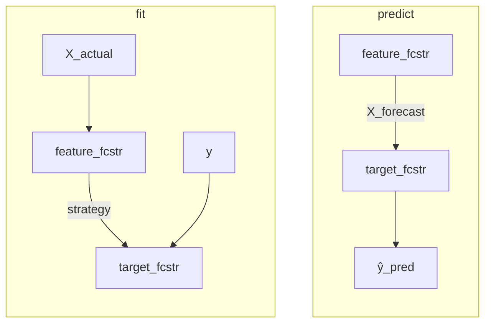

# Forecaster Composition

Yohou provides five classes that compose forecasters into larger forecasting
structures. Each component is itself a full forecaster with
`fit`/`predict`/`observe`/`rewind` lifecycle, not a transformer or preprocessing
step. They address situations where a single forecaster cannot handle the full
problem: additive components in the data (whether latent or known and separately
observable), target columns with different dynamics, features that must be
forecast before the target, or panel groups with fundamentally different
patterns.

All five classes support panel data, integrate with hyperparameter search and
cross-validation, and can be nested inside each other or wrapped by ensemble
voters.

For composing transformers (feature pipelines, scaling chains, lag features), see
[Feature Pipelines](feature-pipelines.md).

## DecompositionPipeline

[`DecompositionPipeline`](/pages/api/generated/yohou.compose.DecompositionPipeline/) decomposes a time series into additive components by fitting forecasters in
sequence. Each forecaster models the residuals left by all previous forecasters,
and the final prediction is the sum of all component predictions:

$$\hat{y}_t = \hat{f}_1(t) + \hat{f}_2(t) + \cdots + \hat{f}_k(t)$$

The `forecasters` parameter takes a list of `(name, forecaster)` tuples. All
entries must be point forecasters (interval or class probability forecasters are
not supported because residuals from probabilistic outputs are not well defined):

```python
from yohou.compose import DecompositionPipeline
from yohou.stationarity import PolynomialTrendForecaster
from yohou.point import SeasonalNaive

pipeline = DecompositionPipeline(forecasters=[
    ("trend", PolynomialTrendForecaster(degree=1)),
    ("seasonality", SeasonalNaive(seasonality=12)),
])
```

The first forecaster fits the raw data and produces a trend forecast. The second
receives the residuals (original minus trend) and models what remains. Ordering
matters: placing a trend model first, then a seasonal model, then a residual
model follows the classical decompose-forecast-recompose pattern.

### Multiplicative decomposition

For multiplicative relationships, pass `target_transformer=LogTransformer()`.
This transforms the target into log-space where multiplication becomes addition,
applies the additive pipeline, and back-transforms the result:

$$y_t = f_1(t) \cdot f_2(t) \cdot \varepsilon_t \quad\Rightarrow\quad \log y_t = \log f_1(t) + \log f_2(t) + \log \varepsilon_t$$

### Feature transformation

The optional `actual_transformer` parameter applies a transformer to exogenous
features once at the pipeline level before any forecaster receives them. All
component forecasters share the same transformed features, so feature
preprocessing does not need to be duplicated inside each component.

### Diagnostic residuals

Setting `store_residuals=True` saves the intermediate residuals after each
component in `pipeline.residuals_`, a dictionary mapping forecaster name to a
Polars DataFrame. This is useful for inspecting whether a component successfully
captured its intended pattern or whether signal remains for downstream
components to model.

## AdditiveForecaster

[`AdditiveForecaster`](/pages/api/generated/yohou.compose.AdditiveForecaster/) is the observed-term, parallel-fit dual of `DecompositionPipeline`. It emits the
same additive sum, but the components are known, separately observable terms
rather than latent residuals, and they are fitted independently rather than in
sequence:

$$\hat{y}_t = \hat{y}_{1,t} + \hat{y}_{2,t} + \cdots + \hat{y}_{k,t} + \hat{\varepsilon}_t$$

Where `DecompositionPipeline` is handed only the aggregate and lets each component
invent its term from the leftover, `AdditiveForecaster` is told how to build each
term's ground truth. The `terms` parameter takes a list of
`(name, extractor, forecaster)` triples, and all forecasters must be point
forecasters:

```python
import polars as pl
from yohou.compose import AdditiveForecaster
from yohou.preprocessing import FunctionTransformer
from yohou.point import SeasonalNaive

# The extractor selects the posted System Lambda feed as the anchor term target.
anchor = FunctionTransformer(func=lambda df: df.select(pl.col("system_lambda_dam").alias("lambda")))

# spp = System Lambda anchor + locational basis (congestion + loss).
# The anchor is forecast on its own; the entire basis falls into the residual.
forecaster = AdditiveForecaster(
    terms=[("lambda", anchor, SeasonalNaive(seasonality=24))],
    residual_forecaster=SeasonalNaive(seasonality=24),
)
```

This is the coarse day-ahead energy split: the System Lambda is a posted feed
forecast by its own model, and the entire locational basis falls into the
residual. Splitting the basis further later is additive, add more terms and the
residual shrinks toward noise.

### Extractors build labels, not features

Each term's `extractor` is a stateless `BaseActualTransformer` applied at fit time
to the target `y` joined with `X_actual`. It manufactures the term's training
target so the term forecaster has something to learn from. The extractor is the
answer key used to train the term, and it is gone at exam time: it runs at `fit`,
`observe`, and `rewind`, but never at `predict`, where each term forecaster
predicts from its own features. An extractor reading the contemporaneous target
to build a label (for example `spp - system_lambda_dam`) is therefore not
leakage; the term forecaster's own feature discipline is a separate concern.

### Granularity and broadcasting

Term granularity is inferred from the extractor output. A single unprefixed series
is a global term, and a `{group}__{column}` panel output is a per-group term. When
the aggregate is a panel, a global term (such as a system-wide System Lambda) is
broadcast to every panel group, while a panel term aligns to its own group. A
group present in the aggregate but missing from a panel term's forecast raises
rather than being silently treated as zero.

### Residual closure

The optional `residual_forecaster` models `eps = y - sum_i y_i`, computed from the
observed extracted terms. This one slot serves two roles: leave the last piece
unextracted and the residual carries a whole component (an exact split); extract
every real term and the residual mops up the small structural gap (an approximate
split). With `residual_forecaster=None`, the prediction is the plain bottom-up
sum. The additive identity holds in level space, so there is no pipeline-level
`target_transformer`; per-term scaling lives inside each term forecaster.

## ColumnForecaster

[`ColumnForecaster`](/pages/api/generated/yohou.compose.ColumnForecaster/) assigns different forecasters to different target columns, then concatenates
predictions horizontally. Each entry in the `forecasters` list is a
`(name, forecaster, columns)` tuple, where `columns` is a string or list of
strings identifying which target columns that forecaster is responsible for.

This is useful when target columns have fundamentally different characteristics.
A slow-moving trend variable might work best with a linear model while a volatile
signal needs gradient boosting. Forcing a single model to handle both can produce
mediocre predictions for each.

### Remainder handling

Columns not claimed by any forecaster are handled by the `remainder` parameter:

- `"drop"` (default): unclaimed columns are excluded from predictions.
- `"passthrough"`: unclaimed columns are passed through unchanged.
- A forecaster instance: unclaimed columns are forecast by that model.

Each column must appear in exactly one forecaster. Overlapping assignments raise
an error.

### Exogenous features and forecaster types

All forecasters receive the full exogenous data (`X_actual`, `X_future`,
`X_forecast`), but each sees only its assigned target columns in `y`. This means
a feature that is relevant to multiple targets only needs to appear once.

Because `ColumnForecaster` wraps arbitrary forecasters, it supports point
predictions, interval predictions, and class probability predictions. The
available methods depend on the capabilities of the inner forecasters. Setting
`n_jobs` enables parallel fitting across column groups.

When `verbose_feature_names_out=True`, output columns are prefixed with the
forecaster name (for example, `sales_model__revenue`), which avoids ambiguity
when multiple forecasters produce columns with the same name.

## ForecastedFeatureForecaster

[`ForecastedFeatureForecaster`](/pages/api/generated/yohou.compose.ForecastedFeatureForecaster/) is a two-stage forecaster for scenarios where exogenous features (`X_actual`)
are available during training but not at prediction time. It chains a
`feature_forecaster` that predicts future feature values with a
`target_forecaster` that uses those forecasts to predict `y`. The feature forecast
reaches the target through the `X_forecast` channel, where it becomes contemporaneous
step columns (`feat_step_1 .. feat_step_H`), so it influences the prediction at every
horizon step. The class requires `X_actual` at fit time and raises a `ValueError` if
it is not provided.



### The distribution shift problem

The core challenge is a training/prediction mismatch. At prediction time the
target forecaster receives forecasted (imperfect) feature values, but perfect
feature values are available during training. Training on perfect features and
predicting with forecasted ones can degrade accuracy. The `strategy` parameter
sets the quality of the in-sample feature forecast the target trains on; in every
strategy that forecast is delivered to the target through `X_forecast`.

### Training strategies

**`"rewind"` (default)** fits the feature forecaster on all data, rewinds it to the
observation horizon, then rolls forward producing one forecast vintage per origin.
The target trains on that rolling forecast, so it sees the same forecast quality at
training as at prediction time, using all the data and avoiding a distribution
mismatch.

**`"predicted"`** splits the training data at position
`int(len(y) * split_ratio)`. The feature forecaster trains on the first portion and
rolls forward over the second, and the target trains on that rolling forecast. This
avoids the distribution shift but sacrifices some training data. The `split_ratio`
parameter (default `0.5`) controls the split point; setting it lower gives the
target forecaster more training data at the cost of a less accurate feature
forecaster.

**`"actual"`** fits the feature forecaster on the full `X_actual` and trains the
target on perfect-foresight features (the actual values windowed forward and labelled
with a vintage). This is the simplest option and uses all data, but it creates a
distribution mismatch: the target trains on perfect features and predicts with
forecasted ones.

### Prediction capabilities

At prediction time `ForecastedFeatureForecaster` calls the feature forecaster to
produce the feature forecast and passes it to the target as `X_forecast`; the target
then predicts `y`. If the target forecaster supports interval predictions or class
probability predictions, those methods become available on the composite. The feature
forecaster always produces point predictions regardless. A target with
`requires_exogenous=False` (such as a naive forecaster) ignores the feature forecast.

### Two cadences and feature_stride

`ForecastedFeatureForecaster` has two independent cadences. The target predict
cadence is the `stride` argument to `observe_predict` (how often the target
forecasts as you walk forward). The feature forecast cadence is the `feature_stride`
constructor parameter (how often the feature forecaster regenerates its forecast).
The default `feature_stride=1` regenerates the forecast at every step.

Set `feature_stride > 1` when the feature forecaster cannot be re-run every step in
production, for example an expensive feature model refreshed daily while the target
predicts hourly. The same `feature_stride` is applied at fit and at serve, so the
target trains on features of the same vintage age it consumes in production. To keep
the forecast covering the target's horizon `H` even when a vintage is up to
`feature_stride - 1` steps old, the feature forecaster is fit and rolled at horizon
`H + feature_stride - 1`. `feature_stride > 1` takes effect only when serving through
`observe_predict` (a bare `predict` always produces a single fresh forecast).

For the data-shaping perspective on exogenous features (the three types `X_actual`,
`X_future`, `X_forecast`, and step-indexed columns), see
[Exogenous Features](exogenous-features.md).

## LocalPanelForecaster

[`LocalPanelForecaster`](/pages/api/generated/yohou.compose.LocalPanelForecaster/) fits a separate clone of a forecaster per panel group rather than a single
global model. The input must be panel data (columns with the `group__column`
naming convention). Each clone sees unprefixed, single-series data: a group named
`store_a` with column `store_a__sales` receives a DataFrame with a plain `sales`
column.

This is appropriate when groups have fundamentally different dynamics (for
example, products with unrelated demand patterns) and a global model would blur
the distinctions. The trade-off is that each group trains on only its own data,
which can be a problem for groups with short histories. Global models share
information across groups at the cost of missing group-specific patterns.

### Exogenous feature routing

Exogenous features can be panel-specific (prefixed, like `store_a__temperature`)
or global (unprefixed, like `holiday_flag`). `LocalPanelForecaster` extracts
each group's prefixed columns, strips the prefixes, and combines them with any
global columns. Each clone therefore receives a clean, unprefixed feature set
tailored to its group.

### Parallel fitting and prediction types

Setting `n_jobs` enables parallel fitting across groups, which is helpful when the
number of groups is large. The class supports whatever prediction types the wrapped
forecaster supports: point predictions are always available, and interval
predictions are available if the inner forecaster provides them.

After fitting, the per-group clones are accessible through the `forecasters_`
attribute, a dictionary mapping group names to fitted forecaster instances.

## State Propagation Through Composite Forecasters

When you call `observe()` on a composite forecaster, the new data flows through
to each sub-component in a pattern that mirrors `fit` and `predict`. Understanding
this flow helps predict what will happen when new data arrives in a production
observe/predict loop.

**[`DecompositionPipeline`](/pages/api/generated/yohou.compose.DecompositionPipeline/)** processes observations in the same order as training.
Each forecaster in the chain predicts its component, subtracts it from the
incoming data, and passes the residual to the next. This preserves the additive
decomposition: calling `observe()` then `predict()` produces the same result as
re-fitting on the extended data, as long as the components remain stable. The
`observe_predict()` method handles this residual decomposition internally,
ensuring rolling evaluation produces correct multi-component predictions.

**[`AdditiveForecaster`](/pages/api/generated/yohou.compose.AdditiveForecaster/)** re-extracts each term's target from the incoming
window and forwards it to that term's forecaster independently, with no residual
threading between terms. When a residual forecaster is present, the residual
`eps = y - sum_i y_i` is recomputed from the freshly extracted terms and observed on
its own. Because the terms are observed rather than latent, `observe()` then
`predict()` matches a refit on the extended window without the ordering sensitivity
the sequential decomposition carries.

**[`ColumnForecaster`](/pages/api/generated/yohou.compose.ColumnForecaster/)** routes each target column to its assigned forecaster.
All forecasters receive the full exogenous data, but each observes only its own
target columns. Calling `observe()` independently updates each column's model
without cross-contamination.

**[`ForecastedFeatureForecaster`](/pages/api/generated/yohou.compose.ForecastedFeatureForecaster/)** chains observations in two stages. The feature
forecaster observes the `X_actual` columns as its target, and the target forecaster
observes `y` (the feature forecast is regenerated through `X_forecast` at predict
time, so the target does not observe features through its own `X_actual` channel).
Because the feature forecaster must advance in step with the target, `observe` and
`rewind` require `X_actual` and raise a `ValueError` if it is omitted. `observe_predict`
rolls over the data one `stride`-sized slice at a time, predicting at each origin, and
regenerates the feature forecast every `feature_stride` steps.

**[`LocalPanelForecaster`](/pages/api/generated/yohou.compose.LocalPanelForecaster/)** dispatches `observe()` to each group's clone
with only the rows belonging to that group. Each group maintains independent
state, so observing new data for one group does not affect others.

Calling `rewind()` reverses these operations across all composite types,
restoring each sub-component to its previous observation window. This is useful
for what-if analysis: observe new data, predict, rewind, try different data,
predict again.

For the metadata routing infrastructure that enables these operations to flow
through search and cross-validation objects, see [Metadata Routing](metadata-routing.md).

## Connections

[Feature Pipelines](feature-pipelines.md) covers composing transformers rather than forecasters. [Exogenous Features](exogenous-features.md) explains the three exogenous parameter types and step-indexed columns that [`ForecastedFeatureForecaster`](/pages/api/generated/yohou.compose.ForecastedFeatureForecaster/) is designed around. [Ensemble Forecasting](ensemble-forecasting.md) describes combining forecasters by voting rather than by decomposition or column assignment. For how parameters like `time_weight` flow through pipelines and search objects, see [Metadata Routing](metadata-routing.md).

For practical recipes, see [How to Compose Feature Pipelines](../how-to/compose-feature-pipelines.md) and [How to Combine Forecasters with Ensembles](../how-to/ensemble-forecasting.md). For a hands-on walkthrough of decomposition, see the [Decomposition Tutorial](../tutorials/decomposition.md). The compose API is documented in the [yohou.compose reference](/pages/api/compose/).
