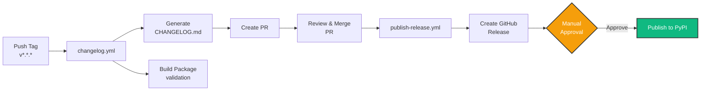

# How to Contribute to Yohou

This guide shows you how to set up a development environment, run the test suite, and submit a pull request to Yohou.

## Code of Conduct

We are committed to providing a welcoming and inclusive environment for all contributors. Please be respectful and considerate in all interactions.

## Getting Started

### Prerequisites

- Python >=3.11
- [uv](https://github.com/astral-sh/uv) (recommended)
- [just](https://github.com/casey/just) (optional, for task automation)
- Git

### Development Setup

1. Fork the repository on GitHub

2. Clone your fork:

```bash
git clone https://github.com/YOUR_USERNAME/yohou.git
cd yohou
```

3. Install dependencies:

```bash
uv sync --group dev
```

4. Install the git hooks:

```bash
uv run prek install -f
```

## Development Workflow

### Making Changes

1. Create a new branch:

```bash
git checkout -b feature/my-feature
```

2. Make your changes

3. Run tests:

=== "just"

    ```bash
    just test
    ```

=== "nox"

    ```bash
    uvx nox -s test
    ```

=== "uv run"

    ```bash
    uv run pytest
    ```

4. Format and fix code:

=== "just"

    ```bash
    just fix
    ```

=== "nox"

    ```bash
    uvx nox -s fix
    ```

=== "uv run"

    ```bash
    uv run ruff format src tests
    uv run ruff check src tests --fix
    uv run ty check src
    ```

5. Commit your changes:

```bash
git add .
git commit -m "feat: add my feature"
```

We follow [Conventional Commits](https://www.conventionalcommits.org/) for commit messages. The commit message format is enforced by commitizen's commit-msg hook, which will validate your commit messages automatically. See [Commit Message Convention](#commit-message-convention) below for the full list of types and examples.

### Running Tests

Yohou uses pytest with markers to categorize tests.

#### Test Markers

| Marker | Description | When to Use |
|--------|-------------|-------------|
| *(none)* | Fast unit tests without subprocess calls or heavy I/O | Default for most tests |
| `@pytest.mark.slow` | Tests that take more than a few seconds, perform heavy computations, make network requests, or access external resources | Long running computations, network access |
| `@pytest.mark.integration` | Tests that run subprocesses, test multiple components together, require complex setup/teardown, or exercise end-to-end workflows | Cross-component validation |
| `@pytest.mark.example` | Validates example notebooks execute without errors (used in `tests/test_examples.py`) | Notebook smoke tests |

Markers can be combined. A test marked with both `@pytest.mark.slow` and `@pytest.mark.integration` is excluded from fast test runs but included in both `test-slow` and `test-full` sessions.

#### Marking Tests

```python
import pytest

@pytest.mark.slow
def test_large_computation():
    # Long-running test
    pass

@pytest.mark.integration
@pytest.mark.slow
def test_end_to_end_workflow():
    # Complex integration test
    pass
```

#### Test Organization

- **Class-based structure**: Group related tests into classes using the `Test<Component><Scenario>` naming pattern.
- **Fixture usage**: Prefer fixtures from `conftest.py` over module-level data. See `tests/conftest.py` for available factories.
- **Property-based testing**: [Hypothesis](https://hypothesis.readthedocs.io/) is available for property-based testing of edge cases and invariants.

#### Running Test Suites

Run fast tests during development:

=== "just"

    ```bash
    just test-fast
    ```

=== "nox"

    ```bash
    uvx nox -s test_fast
    ```

=== "uv run"

    ```bash
    uv run pytest -m "not slow and not integration"
    ```

Run all tests:

=== "just"

    ```bash
    just test
    ```

=== "nox"

    ```bash
    uvx nox -s test
    ```

=== "uv run"

    ```bash
    uv run pytest
    ```

### Code Quality

Run linters and type checkers:

=== "just"

    ```bash
    just lint
    ```

=== "nox"

    ```bash
    uvx nox -s lint
    ```

=== "uv run"

    ```bash
    uv run ruff check src tests
    uv run ty check src
    ```

Format code and fix issues:

=== "just"

    ```bash
    just fix
    ```

=== "nox"

    ```bash
    uvx nox -s fix
    ```

=== "uv run"

    ```bash
    uv run ruff format src tests
    uv run ruff check src tests --fix
    uv run ty check src
    ```

Run all quality checks by combining the fix and test steps above:

=== "just"

    ```bash
    just fix && just test
    ```

=== "uv run"

    ```bash
    uv run prek run --all-files --show-diff-on-failure && uv run pytest
    ```

### Docstring Standards

All public functions, methods, and classes require **NumPy-style** docstrings. Coverage is enforced at 100% by `interrogate`.

**Check docstring coverage:**

```bash
uvx interrogate src
```

**Required sections** (as applicable):

- `Parameters`: all function/method parameters with types and descriptions
- `Returns`: return value type and description
- `Raises`: exceptions raised
- `See Also`: related classes/functions
- `References`: academic references for algorithms or methods used
- `Notes`: implementation details, mathematical background
- `Examples`: usage examples (tested via `pytest --doctest-modules`)

**`See Also` format:**

Use standard numpydoc format with short backtick names. The `mkdocs-autorefs` plugin automatically links backtick references (e.g., `` `ClassName` ``) to the corresponding API pages in rendered documentation. This means plain backtick-wrapped names in docstrings become clickable links in the docs site without any special syntax.

For hyperlinks, always use Markdown syntax: `[text](url)`.

### Documentation

Build documentation:

=== "just"

    ```bash
    just build
    ```

=== "nox"

    ```bash
    uvx nox -s build_docs
    ```

=== "uv run"

    ```bash
    uv run mkdocs build
    ```

Serve documentation locally:

=== "just"

    ```bash
    just serve
    ```

=== "nox"

    ```bash
    uvx nox -s serve_docs
    ```

=== "uv run"

    ```bash
    uv run mkdocs serve
    ```

View all available commands:

```bash
just --list
```

### Glossary System

Yohou has a two-layer glossary system that automatically annotates domain terms across the documentation site:

1. **Hover tooltips**: The `pymdownx.snippets` extension auto-appends `docs/includes/glossary.md` (abbreviation definitions in `*[term]: definition` format) to every page. Combined with the `abbr` Markdown extension and Material's `content.tooltips` feature, every occurrence of a glossary term shows a tooltip on hover.
2. **Navigation links**: `docs/hooks.py` wraps the first occurrence of each glossary term on a page with a link to the [Glossary](../explanation/glossary.md) definition. The `_GLOSSARY_TERMS` dictionary maps display text to anchor slugs.

Both layers work automatically. When writing documentation, use glossary terms as **plain text**. Never write manual links like `[forecasting horizon](glossary.md#forecasting-horizon)`.

To add a new glossary term, update three files:

1. **`docs/pages/explanation/glossary.md`**: Add the definition with an anchor attribute (`{ #my-term }`).
2. **`docs/includes/glossary.md`**: Add an abbreviation entry (`*[my term]: Short definition.`).
3. **`docs/hooks.py`**: Add an entry to the `_GLOSSARY_TERMS` dictionary (`"my term": "my-term"`).

### Adding Examples

All examples are interactive [marimo](https://marimo.io) notebooks that combine code, markdown, and visualizations.

#### Creating a Notebook

Create a new marimo notebook in `examples/<name>.py`:

=== "just"

    ```bash
    just example <name>.py
    ```

=== "uv run"

    ```bash
    uv run marimo new examples/<name>.py
    ```

#### Required Structure

Notebooks serve **tutorials** or **how-to guides** only, never explanation or reference. The structure depends on the category:

**Tutorial notebooks** (category: `tutorial`):

1. **Title**: `# In this notebook, we will [goal]`
2. **Prerequisites**: One-liner stating required prior knowledge
3. **Numbered sections**: `## 1. Section Name`, `## 2. Section Name`, etc. with visible output every cell
4. **What You Built**: Closing section summarizing what was accomplished and linking to next steps

**How-to notebooks** (category: `how-to`):

1. **Title**: `# How to [Verb] [Object]`
2. **Prerequisites**: One-liner stating required prior knowledge
3. **Numbered sections**: `## 1. Section Name`, `## 2. Section Name`, etc. with action-only prose
4. No closing summary; the notebook ends after the last step

**Example intro cell (tutorial)**:

```markdown
# Your First Hyperparameter Search

In this notebook, we will run a hyperparameter search using OptunaSearchCV
and inspect the results.

**Prerequisites:** Python 3.11+ and familiarity with sklearn's fit/predict API.
```

**Example intro cell (how-to)**:

```markdown
# How to Stop Optimization Early with Callbacks

This notebook shows how to attach Optuna callbacks to OptunaSearchCV
to stop a search after a fixed number of trials.

**Prerequisites:** Familiarity with the
OptunaSearchCV quickstart
([View](/examples/quickstart/) · [Open in marimo](/examples/quickstart/edit/)).
```

#### Marimo Cell Conventions

- Use `hide_code=True` on all markdown cells, import cells, and utility/helper cells
- Use `r"""..."""` (raw triple-quoted strings) for markdown cell content
- All notebooks declare dependencies using [PEP 723](https://peps.python.org/pep-0723/) inline script metadata at the top of the file:

    ```python
    # /// script
    # requires-python = ">=3.11"
    # dependencies = [
    #     "plotly",
    #     "scikit-learn",
    # ]
    # ///
    ```

- Dependencies are sorted alphabetically and only list third-party packages actually imported by the notebook.
- `marimo` itself is NOT listed as a dependency (it is the runner, not a dependency of the script).
- To add a dependency: `uv add --script notebook.py <package>` or edit the header manually.
- To run in an isolated sandbox: `uv run marimo edit --sandbox notebook.py`.
- Group all imports into a single hidden cell after the metadata header

#### Content Guidelines

- **Gallery metadata**: Every example notebook should include a `__gallery__` variable defining `title`, `description`, and `category` (`"tutorial"` or `"how-to"`) for the example gallery. Add a `companion` key pointing to the matching doc page path when one exists.
- **Markdown density**: Each numbered section should open with a short markdown cell (one to two sentences) before any code cells. Tutorial sections may be slightly longer; how-to sections should be action-only.
- **No emojis**: Do not use emojis anywhere in notebooks whether it is in headings, content bullets, or concluding remarks.
- **API cross-links**: When mentioning yohou classes or functions in markdown cells, wrap them in backtick-link syntax pointing to the API page.
- **Voice**: Tutorials use "we" (first-person plural). How-to guides use imperative or conditional imperatives ("If you need X, pass Y").

#### Testing and Documentation

Run the example test suite to verify your notebook passes:

=== "just"

    ```bash
    just test-examples
    ```

=== "nox"

    ```bash
    uvx nox -s test_examples
    ```

=== "uv run"

    ```bash
    uv run pytest tests/test_examples.py -m example
    ```

Add a link to your example in `docs/pages/examples/index.md`:

```markdown
- [Example Name](../examples/<name>/): Brief description
```

The mkdocs hooks automatically export notebooks to HTML during docs build. All notebooks in `examples/` are automatically discovered and tested by `test_examples.py` using pytest's parametrization feature, which runs them in parallel for fast validation.

## Submitting Changes

1. Push your changes to your fork:

```bash
git push origin feature/my-feature
```

2. Open a Pull Request on GitHub

3. Ensure all CI checks pass

4. Wait for review and address any feedback

### Pull Request Guidelines

- Write clear, descriptive PR titles following Conventional Commits
- Include a description of the changes
- Add tests for new functionality
- Update documentation as needed
- Ensure all tests pass
- Keep PRs focused and atomic

### Commit Message Convention

We use [Conventional Commits](https://www.conventionalcommits.org/) enforced by commitizen.

#### Commit Types

| Type | Description | Version Bump | Example |
|------|-------------|--------------|---------|
| `feat` | New features | Minor | `feat: add new forecaster` |
| `fix` | Bug fixes | Patch | `fix: resolve scoring edge case` |
| `docs` | Documentation changes | None | `docs: update installation guide` |
| `style` | Code style changes (formatting) | None | `style: format with ruff` |
| `refactor` | Code refactoring | None | `refactor: simplify validation logic` |
| `test` | Adding or updating tests | None | `test: add scorer edge case tests` |
| `chore` | Maintenance tasks | None | `chore: update dependencies` |
| `perf` | Performance improvements | None | `perf: vectorize weight computation` |
| `ci` | CI/CD changes | None | `ci: add Python 3.14 to matrix` |

#### Scopes

Scopes are optional and appear in parentheses after the type:

```text
feat(api): add new endpoint for user data
fix(metrics): handle zero-division in precision
```

#### Breaking Changes

Breaking changes trigger a major version bump. Signal them with `!` after the type or with a `BREAKING CHANGE:` footer:

```text
feat!: redesign authentication system
```

```text
feat: redesign authentication system

BREAKING CHANGE: authentication now requires API keys instead of passwords
```

The commit-msg hook will validate your commit messages and prevent commits that don't follow the convention.

## Release Process

Releases are fully automated through GitHub Actions when a new tag is pushed, with a **manual approval gate** before publishing to PyPI to ensure quality control.



### How It Works

1. **Tag a release** (the tag must be signed, and CI rejects it if it is not):

    ```bash
   git tag -s v0.2.0 -m "Release v0.2.0"
   git push origin v0.2.0
    ```

    One-time setup so `git tag -s` works, and so the signature is verifiable by someone who is not you:

    ```bash
   git config --local user.signingkey <your-key-id>
   git config --local tag.gpgSign true
    ```

    Upload the public half of that GPG key to your account's SSH and GPG keys settings. This is not optional bookkeeping: the release check asks the forge whether the signature verifies, and a signature made with a key nobody can look up fails exactly like no signature at all. Signed tags complement the PEP 740 artifact attestations the publish workflow already produces, so both the tag and the published artifacts are verifiable.

2. **Signature check** (`changelog.yml`, job `verify-tag-signature`):
    - Runs before every other job, and gates them through `needs`
    - Rejects a lightweight tag (there is no tag object to sign) and an unverifiable signature, with a different message for each
    - Pushing the tag is what starts the workflow, so this is detection rather than prevention: the tag is already public when the check runs. It fires before the changelog PR opens and long before anything reaches PyPI, so recovery is `git push --delete origin v0.2.0` and a re-tag

3. **Automated changelog workflow** (`changelog.yml`):
    - Generates changelog from conventional commits using git-cliff
    - Creates a **Pull Request** with the updated CHANGELOG.md
    - Builds the package distributions (wheels and sdist) for **immediate validation**
    - Stores distributions as workflow artifacts (reused later to avoid rebuilding)

4. **Review and merge the changelog PR:**
    - A maintainer reviews the generated changelog
    - Once approved, merge the PR to main

5. **Automated release workflow** (`publish-release.yml`):
    - Creates a GitHub Release with generated release notes
    - Attaches distribution files to the release
    - **Waits for manual approval** before proceeding to PyPI

6. **Manual approval for PyPI publishing:**
    - Designated reviewers receive a notification
    - Review the GitHub Release to verify everything is correct
    - Approve the deployment to publish to PyPI
    - Package is published using Trusted Publishing (OIDC, no tokens needed)

7. **Release notes generation:**
    - All commits since the last tag are analyzed
    - Commits are grouped by type (Added, Fixed, Documentation, etc.)
    - Only commits following conventional format are included
    - Breaking changes are highlighted

### If the publish fails

A publish can fail for reasons that have nothing to do with the release: an upstream
action shipping a broken dependency, a registry outage, a revoked token. The merge that
started it cannot be replayed, and re-running the failed job reuses the old workflow
file, so fixing the cause on `main` is not enough on its own.

Fix the cause, then re-run the pipeline against the **same tag**:

```bash
gh workflow run publish-release.yml -f version=v0.2.0
```

The retry rebuilds from the tag, refreshes the existing GitHub Release rather than
failing on it, and still stops at the `pypi` approval gate. Do **not** delete the tag and
cut a new version to work around a failed publish: that rewrites the changelog and spends
a version number on a fault the release never had.

One case this does not cover: if the previous attempt uploaded some files to PyPI before
failing, the retry stops on the duplicates, because PyPI does not accept a re-upload of a
file it already has. Bump to a new version for that.

### Version Numbering

Yohou follows [Semantic Versioning](https://semver.org/):

| Component | Example | Trigger |
|-----------|---------|---------|
| Major | 1.0.0 | Breaking changes |
| Minor | 0.1.0 | New features (backward compatible) |
| Patch | 0.0.1 | Bug fixes (backward compatible) |

## CI Test Strategy

The CI pipeline uses a two-tier strategy to balance speed with thoroughness:

1. **Fast tests** (`test-fast` job): Runs on minimum and maximum Python versions (3.11, 3.14).
    - Draft PRs: Ubuntu only (quick feedback in ~2 minutes)
    - Ready PRs and main: All OS (Ubuntu, Windows, macOS)

2. **Full test suite** (`test-full` job): Runs all tests (fast + slow + integration) on Ubuntu across all Python versions (3.11 through 3.14) when the PR is not in draft mode or on the main branch. Includes coverage reporting on the minimum supported Python version.

This separation means contributors get rapid feedback during development while still verifying comprehensive correctness before merging. See [Running Tests](#running-tests) for the marker definitions and commands.

## Questions?

If you have any questions, feel free to:

- [Open an issue on GitHub](https://github.com/stateful-y/yohou/issues/new)
- [Start a discussion in the repository](https://github.com/stateful-y/yohou/discussions)
